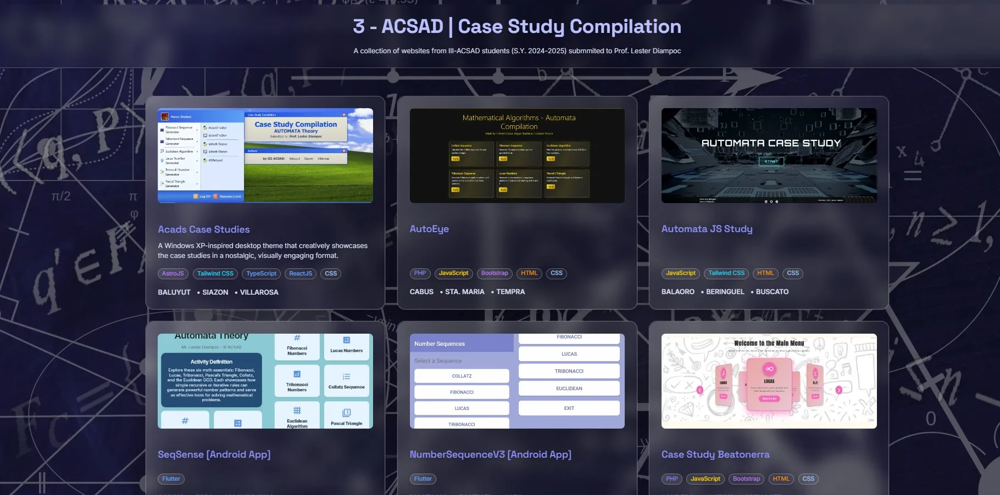

# III-ACSAD | Automata - Case Study Compilation

<div align="center">
  
</div>

A modern Single Page Application (SPA) built with [Astro](https://astro.build/) and [Tailwind CSS](https://tailwindcss.com/), showcasing a collection of website case studies. Each card displays an overview, tech stack, and authors, with a focus on accessibility, modularity, and beautiful UI/UX.

## Description

This project is a curated showcase of website case studies, designed to highlight the work of students and developers. It features a modern, responsive UI with interactive dialogs, keyboard navigation, and accessibility features. The site is built for educators, students, and tech enthusiasts who want to explore real-world projects and their underlying technologies.

## About

This project is a curated showcase of website case studies, designed to highlight the work of students and developers. It features a modern, responsive UI with interactive dialogs, keyboard navigation, and accessibility features. The site is built for educators, students, and tech enthusiasts who want to explore real-world projects and their underlying technologies.

## Features

- **Astro** for fast, modern static site generation
- **Tailwind CSS** for utility-first, responsive styling
- **Modular Components**: Reusable `Card`, `Dialog`, `Button`, and `TechBadge` components
- **Accessibility**: Keyboard navigation, ARIA roles, focus management, and semantic HTML
- **Dynamic Data**: Website and author data loaded from a JSON API file
- **Tech Stack Pills**: Color-coded badges for each technology
- **Multiple Authors**: Supports multiple authors per website, formatted as `SURNAME, Firstname`
- **Dialog Overlays**: Detailed view for each website with focus trap and keyboard support

## Project Structure

```
├── src/
│   ├── data/websites.json         # Website and author data (JSON)
│   ├── components/
│   │   ├── Card.astro           # Website card component
│   │   ├── Dialog.astro         # Website dialog overlay component
│   │   └── ui/
│   │       ├── Button.astro     # Reusable button component
│   │       └── TechBadge.astro  # Reusable tech stack badge
│   ├── layouts/
│   │   └── Layout.astro         # Main layout
│   ├── pages/
│   │   └── index.astro          # Main page
│   ├── styles/globals.css       # Tailwind and global styles
│   ├── types/index.ts           # Shared TypeScript types
│   └── utils/
│       └── techColors.ts        # Tech stack color mapping
├── public/                      # Static assets
├── README.md                    # Project documentation
└── ...
```

## Getting Started

### Prerequisites

- [Node.js](https://nodejs.org/) (v18+ recommended)
- [pnpm](https://pnpm.io/) or [npm](https://www.npmjs.com/) or [yarn](https://yarnpkg.com/)

### Installation

```bash
# Clone the repository
$ git clone <repo-url>
$ cd <repo-directory>

# Install dependencies
$ pnpm install # or npm install or yarn install
```

### Development

```bash
# Start the development server
$ pnpm dev # or npm run dev or yarn dev
```

Visit [http://localhost:4321](http://localhost:4321) to view the app.

### Build

```bash
$ pnpm build # or npm run build or yarn build
```

## Customization

- **Add/Edit Websites:** Edit `src/api/websites.json` to add or update website entries.
- **Add/Edit Tech Colors:** Edit `src/utils/techColors.ts` to customize tech stack badge colors.
- **Add/Edit Authors:** Each website can have multiple authors, formatted as `{ "surname": "DOE", "firstName": "John" }`.

## Accessibility

- All interactive elements are keyboard accessible
- Dialog overlays use focus trap and can be closed with `Esc` or by clicking outside
- Proper ARIA roles and labels are used throughout

## Contributing

Pull requests and suggestions are welcome! Please open an issue or submit a PR.

## Author

- **Siazon, Mark** - [GitHub](https://github.com/mark-siazon)
- Last Modified: June 9, 2025 (✅ Fully Complete Archived)
